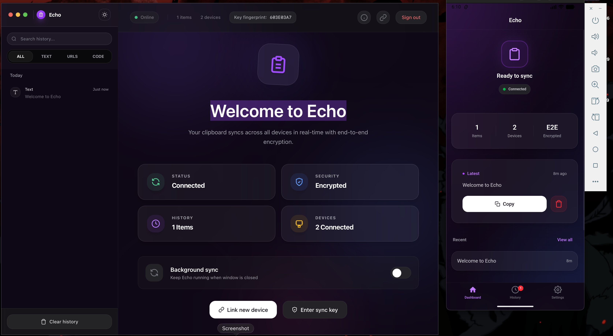
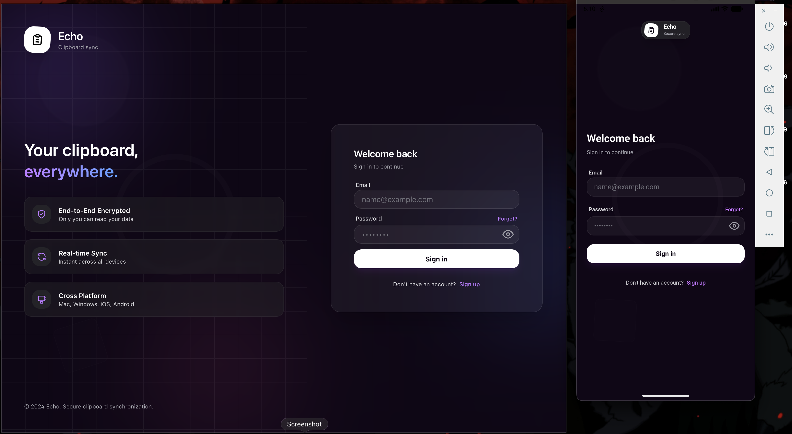

# Echo

[](https://www.rust-lang.org/)
[](https://tauri.app/)
[](https://reactjs.org/)
[](https://opensource.org/licenses/MIT)

Copy on your laptop. Paste on your phone. Real-time clipboard sync across desktop and mobile, under 100ms — end-to-end encrypted. The server never sees your data. It receives ciphertext, stores ciphertext, forwards ciphertext. A blind relay.





## ⚙️ System Specifications

The system is designed around several key technical constraints:
- **Low-Latency Transport**: Bidirectional communication via WebSockets (WS) coupled with Rust-based broadcast channels.
- **Client-Side Cryptography**: Mandatory encryption using **XChaCha20-Poly1305** for all data payloads.
- **Cross-Platform Native Shims**: OS-specific implementations for clipboard monitoring and push-triggered synchronization.
- **State Management**: Distributed state sharding to support high concurrency with minimal lock contention.

## 🔄 System Data Flow

The following diagram illustrates the lifecycle of a clipboard event across the sharded synchronization pipeline:

```text
  User A (Device 1)        Echo Server (Rust)        User B (Device 2)
        |                         |                         |
  [Copy Event]                    |                         |
        |                         |                         |
  [Encrypt: XChaCha20]            |                         |
  [ciphertext + nonce]            |                         |
        |---- ciphertext -------->|                         |
        |                  [DashMap look-up]                |
        |                  [Broadcast fan-out]              |
        |                         |---- ciphertext -------->|
        |                         |                  [Decrypt: XChaCha20]
        |                         |                  [OS Clipboard Write]
        |                         |                         |
```

## 🏗️ Technical Architecture

### Backend Implementation (Rust/Axum)
The synchronization server is built for high-throughput concurrency:
- **Concurrent Hash Maps**: Utilizes `DashMap` for sharded state management, bypassing the bottleneck of standard `RwLock<HashMap>` and optimizing p99 broadcast latency.
- **Efficient Fan-out**: `ClipboardMessage` implements `Clone`; the broadcast channel distributes to N receivers with per-subscriber clones, avoiding shared mutable state entirely.
- **Data Persistence**: **SQLx** for asynchronous, type-safe interaction with PostgreSQL, utilizing indexed queries for efficient history retrieval.

### Frontend Strategy (React + Tauri)
The client adapts its synchronization strategy based on host environment capabilities:
- **Desktop (Tauri)**: Native Rust-side clipboard listeners integrated with the system event loop.
- **Android**: Hybrid Kotlin event listeners combined with background polling for reliability across diverse OEM power-management policies.
- **iOS**: Adaptive polling mechanism that adjusts intervals (500ms to 15s) based on application visibility and user interaction frequency.

## 🔐 Security Protocol

Encryption is strictly decoupled from the transport layer:
1. **Entropy**: 32-byte secret keys are generated locally using cryptographically secure random number generators (CSPRNG).
2. **Distribution**: Key exchange between devices occurs via high-entropy QR codes; keys are never transmitted to the synchronization server.
3. **Payload Isolation**: Every clipboard entry is encrypted with a unique 24-byte nonce. The server acts as a blind relay, storing and broadcasting only ciphertext and nonces.

## 🛠️ Workspace Organization

```text
.
├── backend/           # Axum server + SQLx/PostgreSQL migrations
├── desktop/           # Tauri workspace
│   ├── src/           # React frontend + Crypto primitives
│   └── src-tauri/     # Rust-side Core & Native plugins
```

## 🚦 Deployment & Environment

### Prerequisites
- Rust (Stable)
- Node.js (v18+)
- PostgreSQL (v14+)

### Backend Bootstrap
```bash
cd backend
cp .env.example .env
# Setup PostgreSQL and configure DATABASE_URL in .env
cargo run
```

### Frontend Bootstrap
```bash
cd desktop
npm install
npm run tauri dev
```

## 📈 Engineering Standards

Quality gates run on every change:
- **Static Analysis**: `cargo clippy`, `cargo fmt`, and `eslint`.
- **Benchmarking**: Performance regression testing via `criterion` in `backend/benches`.
- **Security Auditing**: Mandatory `cargo audit` for dependency vulnerability tracking.

