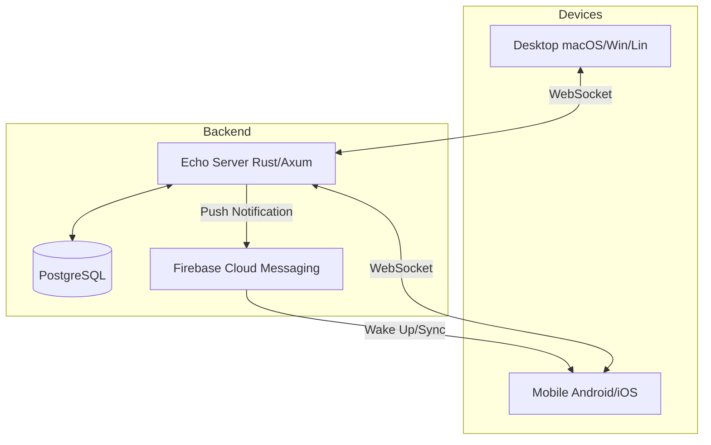

# 📋 Echo

**Universal Clipboard Sync** — Copy on one device, paste on any other. Instantly.


## ✨ Features

- 🔄 **Real-time Sync** — Clipboard changes sync instantly across all devices via WebSockets.
- 📱 **Mobile Support** — Native Android and iOS apps built with Tauri v2.
- 🔔 **Tap to Sync** — Smart push notifications (FCM) explicitly sync clipboard data on mobile to bypass background restrictions.
- 🔐 **End-to-End Encryption** — Optional AES-256-GCM encryption. Your data is encrypted before it leaves your device.
- 🔗 **QR Code Linking** — Securely pair new devices in seconds by scanning a QR code.
- 📜 **Clipboard History** — Access and search your recent clipboard items.
- ⚡ **High Performance** — Rust backend and Rust-based native mobile bindings for maximum speed.

## 🏗️ Architecture



- **Hub-and-Spoke**: A central Rust server coordinates sync.
- **WebSockets**: Primary real-time transport for active devices.
- **FCM (Firebase Cloud Messaging)**: Used to wake up or notify mobile devices when the app is in the background, enabling "Tap to Sync".

## 🚀 Quick Start

### Prerequisites

- [Rust](https://rustup.rs/) (1.70+)
- [Node.js](https://nodejs.org/) (18+)
- [PostgreSQL](https://www.postgresql.org/) (14+)
- **Mobile Dev**: Android Studio (for Android) or Xcode (for iOS).

### 1. Backend Setup

```bash
git clone https://github.com/jephter-olamiposi/echo.git
cd echo/backend

# 1. Setup Database
createdb echo_db
# Copy environment file
cp .env.example .env
# Update .env with your DATABASE_URL

# 2. Run Migrations
cargo install sqlx-cli
sqlx migrate run

# 3. Setup Firebase (Optional for Mobile Push)
# Place your 'service-account.json' in the backend/ directory
# and update .env with GOOGLE_APPLICATION_CREDENTIALS=./service-account.json

# 4. Run Server
cargo run
# Server starts at http://0.0.0.0:3000
```

### 2. Frontend & Mobile Setup

The desktop and mobile apps share the same codebase in `desktop/`.

```bash
cd desktop

# 1. Install Dependencies
npm install

# 2. Configure Env
cp .env.example .env
# Set VITE_API_URL=http://<YOUR_IP>:3000
# Set VITE_WS_URL=ws://<YOUR_IP>:3000
# IMPORTANT: For mobile, use your local IP, not localhost!

# 3. Run Desktop Dev
npm run tauri dev

# 4. Run Mobile Dev
# Ensure an emulator is running or device is connected
npm run tauri android dev
# OR
npm run tauri ios dev
```

## 🔐 End-to-End Encryption

Echo supports optional E2EE. When enabled:
1.  A random 256-bit key is generated from your passphrase (PBKDF2).
2.  Content is encrypted with AES-256-GCM before sending to the server.
3.  The server stores only encrypted blobs.
4.  Other devices need the same passphrase to decrypt and view content.

## 📱 "Tap to Sync" (Mobile)

On Android and iOS, background clipboard access is restricted. Echo solves this with **Tap to Sync**:
1.  When you copy on Desktop, the Server receives the data.
2.  Server sends a high-priority FCM notification to your Mobile device.
3.  Notification appears: *"Tap to sync from Desktop"*.
4.  Tapping the notification opens Echo and instantly syncs the clipboard.

## 🔧 Configuration

### Backend (`backend/.env`)

| Variable | Description | Required |
|----------|-------------|----------|
| `DATABASE_URL` | Postgres connection string | Yes |
| `JWT_SECRET` | Secret for signing auth tokens | Yes |
| `GOOGLE_PROJECT_ID` | Firebase Project ID (for FCM) | No |
| `FIREBASE_SERVICE_ACCOUNT` | Path to service account (or use `FCM_SERVICE_ACCOUNT_PATH`) | No |
| `FCM_SERVICE_ACCOUNT_JSON` | Raw JSON content of service account | No |
| `ALLOWED_ORIGINS` | CORS origins (comma-separated) | No (defaults to localhost+tauri) |

### Frontend (`desktop/.env`)

| Variable | Description | Default |
|----------|-------------|---------|
| `VITE_API_URL` | HTTP URL of backend | `http://localhost:3000` |
| `VITE_WS_URL` | WebSocket URL of backend | `ws://localhost:3000` |

## 🤝 Contributing

PRs are welcome! Please match the existing code style (Rustfmt for backend, Prettier for frontend).

## ⚡ Performance

Echo is designed for high throughput and low latency:

### Design Decisions

| Component | Choice | Why |
|-----------|--------|-----|
| **Concurrent State** | DashMap | 3-5x faster than RwLock<HashMap> for our read-heavy workload |
| **Real-time Transport** | tokio broadcast channels | Zero-copy fan-out to all connected devices |
| **Rate Limiting** | Token bucket (300/min, 50ms debounce) | Prevents abuse without impacting normal use |
| **Connection Keepalive** | 15s ping interval | Balances responsiveness vs. battery/bandwidth |

### Running Benchmarks

```bash
cd backend

# Run all benchmarks
cargo bench

# Run specific benchmark
cargo bench --bench rate_limiting
cargo bench --bench broadcast

# Generate HTML report (requires gnuplot)
cargo bench -- --save-baseline main
```

### Benchmark Results (M1 MacBook Pro)

| Benchmark | Throughput | Notes |
|-----------|------------|-------|
| Rate limit check | ~50M ops/sec | DashMap single-shard access |
| Broadcast fan-out (10 subscribers) | ~2M msgs/sec | Per-user channel isolation |
| WebSocket message parse | ~1.5M msgs/sec | serde_json deserialization |

See [backend/ARCHITECTURE.md](backend/ARCHITECTURE.md) for detailed design documentation.

## 📄 License

MIT © [Jephter Olamiposi](https://github.com/jephter-olamiposi)
